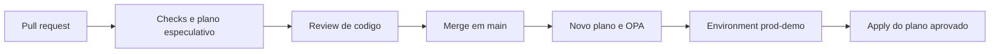

# Terraform Delivery Portfolio

Laboratorio publico de entrega Terraform com controles verificaveis do GitHub.

## Executavel hoje

- PR: fmt, validate, plan sem credenciais e OPA sobre plano real.
- Testes de regressao: delete e as duas ordens de replacement bloqueados.
- Main: novo plano, revisao de deployment e apply do plano salvo.
- Actions fixadas por SHA, Dependabot e token somente leitura.

O deploy fica desativado ate configurar `prod-demo` e a variavel
`ENABLE_DEMO_DEPLOY=true`. Siga [o roteiro](docs/08b-repositorio-publico.md).

## Limite da demonstracao

`terraform_data` usa state local efemero e dados sinteticos. Cada runner novo
planeja uma criacao; isso e esperado aqui. Nao representa state persistente,
provisionamento AWS ou rollback real. Nenhuma credencial AWS e necessaria.

O proximo incremento adiciona S3 com SSE-S3 e lock, OIDC e roles por ambiente
e funcao. Os planos reais e states devem permanecer em armazenamento restrito.

## Fluxo



## Evidencias do portfolio

Registre links reais em `docs/evidencias.md`: PR aprovado, check bloqueando
merge, deployment aguardando revisao, branch rejeitada e apply concluido.
Use o modelo ao final do roteiro. Nao apresente controles apenas planejados
como ja implementados. Ainda faltam scanners HCL, lint de workflows,
backend remoto e testes de permissao AWS neste template inicial.

## Verificacao local

Com Terraform 1.14.7, OPA 1.20.2 e jq instalados:

```bash
bash scripts/test-policy-fixtures.sh
terraform -chdir=infra init -backend=false
terraform -chdir=infra fmt -check
terraform -chdir=infra validate
terraform -chdir=infra plan -out=tfplan
terraform -chdir=infra show -json tfplan > infra/tfplan.json
opa eval --fail-defined --data policies/opa --input infra/tfplan.json 'data.terraform.guard.deny[_]'
```
