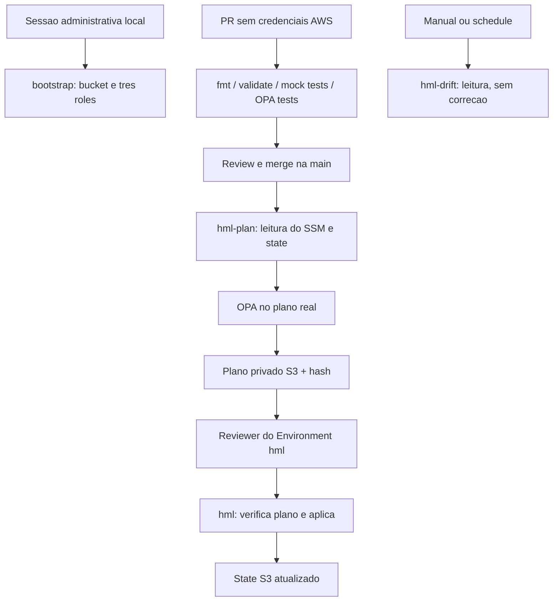

# Ponte 8C - Primeira entrega real na AWS

Vamos conectar os controles que voce ja testou a um recurso AWS real: um
parametro SSM **String/Standard** chamado `/portfolio/hml/release/revision`.
Ele contem somente `v1`, `v2` etc. Nao e senha, token nem segredo.

Comecamos apenas com **hml**. `prod-demo` continua sendo a demonstracao antiga.
Nao crie prod real agora. Notificacoes continuam na etapa 9.

## 1. O que muda na pratica

| Antes: demo | Agora: AWS |
| --- | --- |
| terraform_data e state efemero | SSM real e state persistente no S3 |
| Token GitHub somente leitura | Mesmo token + OIDC por job AWS |
| Plano sintetico em artifact | Plano real em S3 privado, SSE-S3 |
| Apply demonstra o gate | Apply cria/atualiza o parametro real |
| Runner novo tende a criar novamente | Segundo deploy deve mostrar zero mudancas |



Existem duas aprovacoes com objetivos diferentes: review do PR aprova o codigo;
review do Environment aprova executar o plano pos-merge. A aprovacao ocorre antes
de iniciar o job apply, portanto antes de ele receber as credenciais dessa role.

## 2. Arquivos e responsabilidades

| Caminho | Responsabilidade |
| --- | --- |
| `bootstrap/` | Bucket privado, protecoes e IAM; executado localmente por administrador |
| `stacks/aws-hml/` | Parametro SSM; executado pela pipeline |
| `.github/workflows/aws-oidc-claims.yml` | Conferir identidade GitHub, sem assumir role AWS |
| `.github/workflows/aws-delivery.yml` | Plan e apply em jobs/roles diferentes |
| `.github/workflows/aws-drift.yml` | Detectar divergencia sem escrita no recurso |
| `.github/actions/aws-session/` | Setup Terraform e credenciais temporarias, com actions por SHA |
| `scripts/aws_delivery.py` | Plano privado, OPA, resumo sem valores e verificacao antes do apply |
| `bootstrap/tests/` e `stacks/aws-hml/tests/` | Contratos com provider mock; nao acessam AWS |

Terraform CLI: `1.14.7`. AWS provider: `5.100.0`, conservando a serie testada
no lab anterior, com `.terraform.lock.hcl` versionado. Nao e uma afirmacao de
que esta seja a ultima versao. Atualizar provider deve ser um PR proprio.

## 3. Criar a branch e publicar o codigo sem ativar AWS

Sua copia estava em `test/github-security-gates`. Nao precisamos incluir os
commits daquele teste na feature. Os comandos abaixo partem da main remota;
as alteracoes locais desta entrega seguem para a branch nova.

```bash
cd /home/diego/clients/projects/projeto-pipeline-plataform/pipeline/terraform-delivery-portfolio
git status
git fetch origin
git switch -c feat/aws-real-hml origin/main
git add .github/workflows/ci.yml .github/workflows/aws-delivery.yml \
  .github/workflows/aws-drift.yml .github/workflows/aws-oidc-claims.yml \
  .github/actions/aws-session .gitignore bootstrap stacks scripts/aws_delivery.py \
  scripts/oidc_claims.py scripts/tests README.md docs/08c-aws-real.md
git diff --cached --stat
git diff --cached
git commit -m "feat: add private AWS hml delivery with OIDC and separate roles"
git push -u origin feat/aws-real-hml
```

Se o switch recusar por conflito com alteracoes locais, pare e confira o diff;
nao use `reset --hard`. Nao use `git add -f` para arquivos de state ou tfvars.
Os dois `.terraform.lock.hcl` devem entrar no commit.

No GitHub, antes de integrar:

1. Defina `ENABLE_DEMO_DEPLOY=false` para o deploy sintetico nao competir por sua atencao.
2. Deixe `ENABLE_AWS_LAB` e `ENABLE_AWS_DRIFT` ausentes ou `false`.
3. Acrescente `aws-actions/configure-aws-credentials@*` a allowlist de Actions.
4. Abra PR, espere `terraform-ci` verde, revise e faca merge.

O CI valida os dois roots Terraform e executa `terraform test` com mocks.
Mesmo que voce tenha uma conta AWS configurada localmente, esses testes nao
criam bucket, role nem SSM. O deploy AWS permanece desativado neste momento.

Depois do merge, atualize seu checkout:

```bash
git switch main
git pull --ff-only origin main
```

## 4. Criar os Environments reais e conferir OIDC

Crie os tres em **Settings > Environments** antes de ativar a pipeline:

| Environment | Branch permitida | Reviewer | Role que recebera depois |
| --- | --- | --- | --- |
| `hml-plan` | Branch exata `main` | Sem reviewer | `portfolio-hml-plan` |
| `hml` | Branch exata `main` | Required reviewer | `portfolio-hml-apply` |
| `hml-drift` | Branch exata `main` | Sem reviewer | `portfolio-hml-drift` |

Em todos: **Selected branches and tags**, regra do tipo **Branch**, nome `main`.
Em `hml`, repita o modelo de reviewers que voce validou em `prod-demo`.
Desabilite bypass de administrador. So habilite prevent self-review quando
houver outra pessoa para aprovar; isso tambem afeta o workflow de diagnostico.

Execute **Actions > AWS - Inspect OIDC claims > Run workflow** na `main`,
primeiro com `hml-plan`. Ele pede um token ao GitHub, mostra alguns claims,
mas nao assume role nem publica o JWT completo.

Exemplo ilustrativo:

```json
{
  "sub": "repo:DiegoRamosCloud@OWNER_ID/terraform-delivery-portfolio@REPO_ID:environment:hml-plan",
  "aud": "sts.amazonaws.com"
}
```

Guarde a parte `DiegoRamosCloud@OWNER_ID/terraform-delivery-portfolio@REPO_ID`.
O novo repo tem outro ID, portanto o sub do repo privado nao serve aqui.
O bootstrap atual espera o formato imutavel com IDs; se o emitido for diferente,
ajuste o contrato conscientemente, sem adicionar wildcard para contornar erro.
[Formato de claims OIDC](https://docs.github.com/en/actions/reference/security/oidc).

Repita para `hml` e `hml-drift`: somente o nome do Environment deve mudar.
O sub com Environment nao inclui a branch. A restricao a main vem do GitHub,
e a trust AWS exige repo + Environment exatos. Sao controles complementares.

## 5. Bootstrap: preparar a base com sua sessao local

Por que nao fazer isso pela propria pipeline? Ela ainda nao tem uma role para
assumir nem um backend. Uma identidade administrativa inicial cria essa base.
Depois o workload opera com roles menores, sem permissao IAM.

Use um perfil AWS ja autorizado para a conta de laboratorio, preferencialmente
SSO/credenciais temporarias. `portfolio-admin` abaixo e um exemplo: substitua
pelo nome do seu perfil. Nao crie access key para colocar no GitHub.

```bash
aws configure list-profiles
export AWS_PROFILE=portfolio-admin
# Apenas se esse perfil usa IAM Identity Center/SSO:
aws sso login --profile "$AWS_PROFILE"
aws sts get-caller-identity
```

Confira a conta antes de prosseguir. O provider tambem usa `allowed_account_ids`
para recusar credenciais de outra conta. O operador precisa gerenciar o bucket,
as tres roles/policies e consultar o OIDC provider existente. SCPs/boundaries
podem restringir essas operacoes; os workflows nao recebem essas permissoes.

```bash
cp bootstrap/terraform.tfvars.example bootstrap/terraform.tfvars
```

Edite o arquivo local:

```hcl
aws_account_id            = "SUA_CONTA_DE_12_DIGITOS"
aws_region                = "us-east-1"
bucket_name               = "portfolio-state-SUA-CONTA-SUFIXO-UNICO"
github_subject_repository = "DiegoRamosCloud@ID_REAL/terraform-delivery-portfolio@ID_REAL"
```

Use valores reais em todos os placeholders, bucket em minusculas e exclusivo
globalmente. Nao use o bucket dos labs antigos nem um bucket de cliente.
O arquivo `.tfvars` e ignorado pelo Git; ele nao deve conter credenciais.

```bash
terraform -chdir=bootstrap init -input=false
terraform -chdir=bootstrap plan -out=bootstrap-plan
terraform -chdir=bootstrap show -no-color bootstrap-plan
```

Revise: criacao de **um bucket**, seus controles e **tres roles com policies**.
O bootstrap consulta o OIDC provider existente na conta, sem recria-lo ou
assumir sua gestao. O SSM ainda nao sera criado.

```bash
terraform -chdir=bootstrap apply bootstrap-plan
terraform -chdir=bootstrap output
```

O bucket usa SSE-S3 (`AES256`), versionamento, bloqueio publico, ownership sem
ACL e policy negando HTTP. `prevent_destroy` evita destruir o bucket por
Terraform sem uma mudanca deliberada de codigo; nao impede um administrador
de apagar objetos via AWS. S3 gera cobranca por armazenamento/requisicoes;
acompanhe Billing. Nao criamos KMS, EC2, EKS, NAT ou DynamoDB neste incremento.

## 6. Migrar o state do bootstrap para S3

O primeiro apply precisou de state local porque o bucket nao existia.
Migre esse state; nao copie somente o arquivo para S3 manualmente.

```bash
export LAB_BUCKET="$(terraform -chdir=bootstrap output -json github_repository_variables | jq -r '.TFSTATE_BUCKET')"
export LAB_REGION="$(terraform -chdir=bootstrap output -json github_repository_variables | jq -r '.AWS_REGION')"
cp bootstrap/terraform.tfstate bootstrap/terraform.tfstate.before-migration
cp bootstrap/backend.tf.example bootstrap/backend.tf
terraform -chdir=bootstrap init -migrate-state \
  -backend-config="bucket=$LAB_BUCKET" \
  -backend-config="region=$LAB_REGION"
```

Leia a pergunta de migracao e confirme a copia do state existente. Depois:

```bash
terraform -chdir=bootstrap plan
aws s3api head-object --bucket "$LAB_BUCKET" --key bootstrap/terraform.tfstate \
  --query '{VersionId:VersionId,Encryption:ServerSideEncryption}'
```

Esperado: nenhuma mudanca no bootstrap e objeto versionado com AES256.
`backend.tf` e a copia local do exemplo ignorada pelo Git; outro operador deve
recriar esse arquivo e inicializar com o bucket correto para manter o bootstrap.
Guarde o backup local em armazenamento restrito ate validar a migracao.

Os states sao separados:

```text
bootstrap/terraform.tfstate                # bucket e IAM; apenas operador
portfolio/hml/ssm/terraform.tfstate         # workload; pipeline
portfolio/hml/ssm/terraform.tfstate.tflock  # lock temporario
plans/hml/RUN_ID/ATTEMPT/plan.zip           # plano privado por execucao
```

Nao use Terraform workspaces adicionais neste lab. A pipeline trabalha no
workspace default, com chave fixa. [Backend S3 e lock](https://developer.hashicorp.com/terraform/language/backend/s3).

## 7. Entender e testar as permissoes

| Permissao | Plan | Apply | Drift |
| --- | --- | --- | --- |
| Ler o parametro SSM do lab | Sim | Sim | Sim |
| Criar/alterar/remover esse SSM | Nao | Sim | Nao |
| Ler o objeto de state do workload | Sim | Sim | Sim |
| Gravar esse state | Nao | Sim | Nao |
| Criar/ler/remover `.tflock` | Sim | Sim | Sim |
| Enviar plano privado | Sim | Nao | Nao |
| Baixar plano privado | Nao | Sim | Nao |
| Ler state do bootstrap / administrar IAM | Nao | Nao | Nao |

As tres roles podem listar nomes de objetos somente no bucket dedicado.
Essa listagem nao permite ler conteudos. Get/Put sao limitados aos objetos
descritos acima. Nao reutilize esse bucket para dados de clientes.

"Read-only" refere-se ao recurso e state: plan/drift precisam escrever/remover
o lock para coordenar acesso; plan tambem precisa enviar seu plano privado.
Nao precisam de permissao de escrita no parametro SSM.

Com sua sessao administrativa, execute uma simulacao sem alterar o recurso:

```bash
export LAB_ACCOUNT="$(aws sts get-caller-identity --query Account --output text)"
aws iam simulate-principal-policy \
  --policy-source-arn "arn:aws:iam::$LAB_ACCOUNT:role/portfolio-hml-plan" \
  --action-names ssm:PutParameter \
  --resource-arns "arn:aws:ssm:$LAB_REGION:$LAB_ACCOUNT:parameter/portfolio/hml/release/revision" \
  --query 'EvaluationResults[].{Action:EvalActionName,Decision:EvalDecision}'
```

Espere `implicitDeny`. Repita mudando a role para `portfolio-hml-drift`
(tambem negado) e `portfolio-hml-apply` (`allowed`). A simulacao precisa de
`iam:SimulatePrincipalPolicy` na identidade local e nao substitui uma chamada
real: trust OIDC, SCPs e outros controles tambem podem impedir acesso efetivo.

## 8. Cadastrar variaveis e ativar somente delivery

Rode `terraform -chdir=bootstrap output` novamente. Cadastre:

**Settings > Secrets and variables > Actions > Variables**, nivel repositorio:

| Nome | Origem |
| --- | --- |
| `AWS_ACCOUNT_ID` | `github_repository_variables.AWS_ACCOUNT_ID` |
| `AWS_REGION` | `github_repository_variables.AWS_REGION` |
| `TFSTATE_BUCKET` | `github_repository_variables.TFSTATE_BUCKET` |
| `ENABLE_AWS_LAB` | `true`, apenas depois de configurar roles abaixo |
| `ENABLE_AWS_DRIFT` | `false` por enquanto |

**Settings > Environments > cada ambiente > Environment variables**:

| Environment | Variavel | Valor |
| --- | --- | --- |
| `hml-plan` | `AWS_ROLE_ARN` | ARN de `portfolio-hml-plan` |
| `hml` | `AWS_ROLE_ARN` | ARN de `portfolio-hml-apply` |
| `hml-drift` | `AWS_ROLE_ARN` | ARN de `portfolio-hml-drift` |

Nao crie `AWS_ROLE_ARN` de repositorio como fallback. Isso facilita perceber
um environment sem role configurada. ARNs/IDs identificam recursos, nao sao
credenciais. Nao cadastre access key nem session token no GitHub.

## 9. Primeiro deployment real

Execute **Actions > AWS - Hml delivery > Run workflow > main**.

No job **plan**:

1. Testes OPA rodam antes de obter credenciais AWS.
2. OIDC assume `portfolio-hml-plan` no Environment `hml-plan`.
3. Init conecta ao backend. Na primeira execucao, o state do workload ainda pode nao existir.
4. Plan calcula criar o SSM, sem cria-lo. OPA valida o JSON real.
5. O plano aprovado pelo OPA vai ao S3 privado. O summary mostra contagens,
   commit e hash; valores/raw output nao sao publicados.

Esperado no primeiro plano: **Create: 1, Update: 0, Delete: 0**.
O job **apply** deve aguardar review no Environment `hml`.

Confira o commit e o codigo da stack. E uma stack com um unico parametro,
por isso o resumo de contagens e suficiente para este exercicio. Em uma stack
maior, reviewers precisam inspecionar os detalhes em ferramenta/armazenamento
restrito, sem publicar valores no repo publico.

Ao aprovar, o job recebe outra sessao: `portfolio-hml-apply`. Ele baixa o plano
da mesma execucao/tentativa e verifica hash, commit, lockfile, stack, versao e
idade maxima de **60 minutos**. Depois executa `terraform apply tfplan`.
Nao recalcula o plano silenciosamente apos a aprovacao.

O TTL do script e um limite de validade para aplicar, nao de existencia do
objeto S3. O lifecycle limpa planos/versionamentos desse prefixo posteriormente.
O lifecycle nao expira state nem suas versoes.

Confira localmente, com seu perfil autorizado:

```bash
aws ssm get-parameter --region "$LAB_REGION" \
  --name /portfolio/hml/release/revision \
  --query 'Parameter.{Name:Name,Value:Value,Version:Version}'
aws s3api head-object --bucket "$LAB_BUCKET" \
  --key portfolio/hml/ssm/terraform.tfstate \
  --query '{VersionId:VersionId,Encryption:ServerSideEncryption}'
```

Resultado: SSM com `v1`, state persistido e criptografia AES256. Agora rode
delivery novamente na mesma main: o plano deve ter **zero create/update/delete**.
Esse e o ganho observavel do state remoto. O fluxo ainda pede aprovacao para
apply sem mudancas; mantivemos isso simples e explicito neste incremento.

## 10. Mudanca real por PR: v1 para v2

```bash
git switch main
git pull --ff-only origin main
git switch -c feat/aws-release-v2
```

Edite **`stacks/aws-hml/main.tf`**, default de `revision`, para `v2`.
Nao edite `infra/main.tf`: esse arquivo pertence ao demo antigo.

```bash
terraform -chdir=stacks/aws-hml fmt
git add stacks/aws-hml/main.tf
git commit -m "feat: release AWS hml revision v2"
git push -u origin feat/aws-release-v2
```

Abra PR. O CI faz validacao estatica e testes mock; ele **nao consulta o state
AWS no PR**. A main revisada e a fronteira para dar credenciais a esse codigo.
Terraform pode executar providers/data sources: mesmo uma role de leitura
seria capaz de extrair dados se entregue a codigo malicioso de PR.

Apos merge, espere **Update: 1**, sem criar/remover SSM. Aprove e confira valor
`v2` e incremento de versao no SSM. Isso fecha PR -> revisao -> plano real ->
aprovacao -> alteracao cloud -> persistencia de state.

## 11. Drift com a terceira role

Depois do primeiro deployment, habilite `ENABLE_AWS_DRIFT=true` e execute
**AWS - Hml drift** na main. Esperado: `Terraform exit 0`, sem diferencas.
O schedule roda em dias uteis as 12:23 UTC, sujeito ao agendamento do GitHub.

Para quebrar de forma controlada, use sua sessao local e altere apenas o
parametro ficticio deste lab:

```bash
aws ssm put-parameter --region "$LAB_REGION" \
  --name /portfolio/hml/release/revision \
  --type String --value manual-drift --overwrite
```

Execute drift novamente: deve detectar uma atualizacao e falhar com indicacao
de `Terraform exit 2`. Ele nao chama apply nem tem `ssm:PutParameter`.
Confirme com `get-parameter` que o valor manual continua: deteccao nao e correcao.

Para corrigir, investigue/registre a alteracao e execute delivery da main atual,
revise o plano e aprove. Ele restaura o valor declarado no codigo. Se a alteracao
manual for a desejada, ajuste o codigo por PR em vez de aplicar automaticamente.

Drift e delivery compartilham o grupo de concurrency `aws-hml-ssm`, alem do
lock S3. GitHub nao oferece uma fila FIFO ilimitada por grupo: uma nova execucao
pode substituir outra pendente. Nao use disparos repetidos como fila de trabalho.

## 12. Falhas e tratamento

| Sintoma | Causa provavel | Tratamento |
| --- | --- | --- |
| Workflow AWS pulado | Variavel ENABLE ausente/false | Configurar apos concluir bootstrap/Environments |
| STS nega OIDC | Sub, role ou conta incorretos | Comparar claims e `trusted_subjects`, sem ampliar wildcard |
| Apply nao pede review | `hml` sem required reviewer | Desativar ENABLE_AWS_LAB e corrigir Environment antes de repetir |
| Erro antes do assume role | AWS_ROLE_ARN/region nao definidos ou allowlist | Conferir escopo das variaveis e action permitida |
| Init AccessDenied | Permissoes do bucket/state/lock ou policy organizacional | Conferir policy da role do job e CloudTrail; nao anexar AdministratorAccess |
| Plan SSM AccessDenied | Prefixo alterado ou permissao de leitura ausente | Alinhar stack e policy via PR/bootstrap |
| Hash divergente | Objeto diferente do produzido pelo job plan | Nao aplicar; investigar e gerar outro plano |
| Plano expirado | Mais de 60 minutos antes de aplicar | Re-run all jobs; nova revisao/aprovacao |
| NoSuchKey em nova tentativa | Reexecutou apenas apply | Re-run all jobs; chave inclui tentativa |
| Saved plan is stale | State alterado depois do plan | Novo plan/policy/review, nunca forcar o antigo |
| Error acquiring the state lock | Outro comando ativo ou lock abandonado | Identificar dono/processo; nao usar -lock=false |
| Drift antes do primeiro apply | Recurso ainda nao provisionado | Concluir baseline primeiro |
| OIDC provider inexistente no bootstrap | Conta/perfil diferente ou identidade ainda nao criada | Corrigir conta ou provisionar provider em stack de identidade antes |

O script distingue erro de execucao de divergencia de drift. Raw output de
Terraform/AWS e capturado e descartado ao encerrar o job para nao vazar dados
em logs publicos. Por isso um erro pode mostrar somente categoria/operacao.
Para aprofundar, use CloudTrail/Event history (eventos suportados), simulacao
IAM e reproducao em terminal privado com acesso apropriado. Eventos de objetos
S3 precisam de data events configurados para aparecer em trilha de auditoria;
nao assumimos que isso esteja habilitado, nem ativamos coleta paga neste lab.

Para inspecionar o plano em terminal privado, obtenha bucket/run/tentativa da
execucao e use seu perfil administrativo:

```bash
aws s3 cp "s3://$LAB_BUCKET/plans/hml/RUN_ID/ATTEMPT/plan.zip" /tmp/portfolio-plan.zip
sha256sum /tmp/portfolio-plan.zip
```

Compare com o hash do summary. Extraia em uma pasta privada, leia
`manifest.json` e use Terraform 1.14.7 com o provider do lockfile para
`terraform show /caminho/tfplan`. Nao publique esse arquivo nem cole sua saida
em issues publicas. O hash verifica integridade, nao substitui a confianca no
workflow/role de plan. [Conteudo sensivel de planos](https://developer.hashicorp.com/terraform/cli/commands/plan#out-filename).

Um plano salvo nao segura lock durante toda a aprovacao humana. State novo
pode tornar o plano stale; alteracao externa na AWS nem sempre muda o serial
do state. O limite de idade reduz a janela, mas nao torna o plano imune a drift.

## 13. Evidencias, limites e encerramento

Registre em `docs/evidencias.md`:

- Claims OIDC conferidos, sem JWT completo.
- PR que adicionou infraestrutura e resultado dos testes mock.
- Plan create=1 aguardando aprovacao, apply concluido e segundo plan sem mudanca.
- PR v1 -> v2, update=1 e verificacao do SSM.
- Drift detectado, sem autocorrecao, seguido de correcao aprovada.
- Testes de policy local/simulador e, separadamente, resultados reais AWS.

Os testes locais verificam contratos e fluxo do script; nao provam permissao
efetiva na sua conta. A execucao real ainda precisa confirmar OIDC, IAM, S3,
SSM e gates configurados na interface. Nao marcamos isso como validado antes
de voce executar. Ainda faltam scanners HCL/lint de workflow como required
checks, bootstrap automatizado de configuracao GitHub e isolamento por conta.

Ao pausar o lab, defina as duas variaveis ENABLE_AWS como false. Isso nao apaga
recursos. Para encerrar definitivamente, desative workflows, revise um plano
de destroy da stack SSM com sua sessao administrativa e execute-o conscientemente.
O gate OPA bloqueia delete de proposito; exclusao e procedimento administrativo
separado, nao motivo para desativar a policy globalmente. Preserve backups/state
antes de planejar remover IAM/bucket. O bucket tem prevent_destroy e versoes:
nao use force_destroy nem esvazie-o para resolver um erro de rotina.
